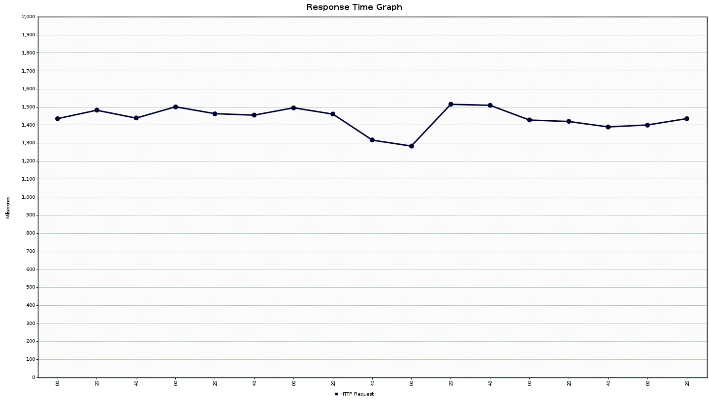
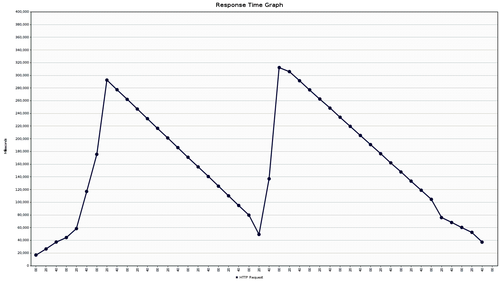
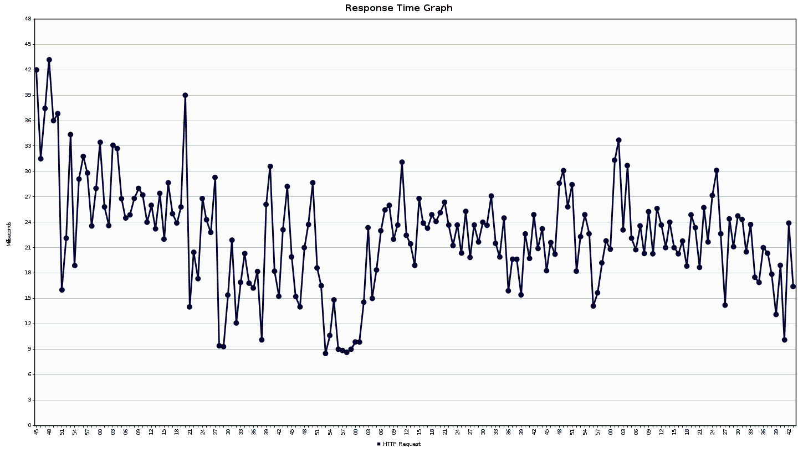
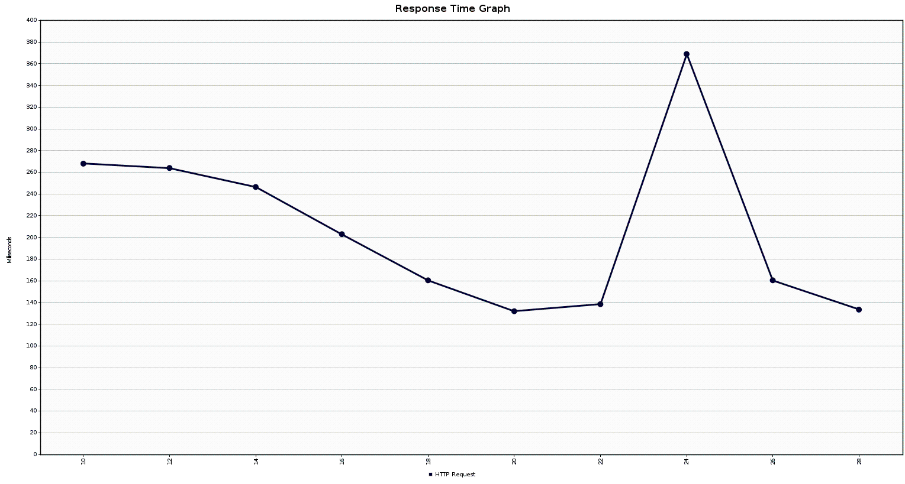
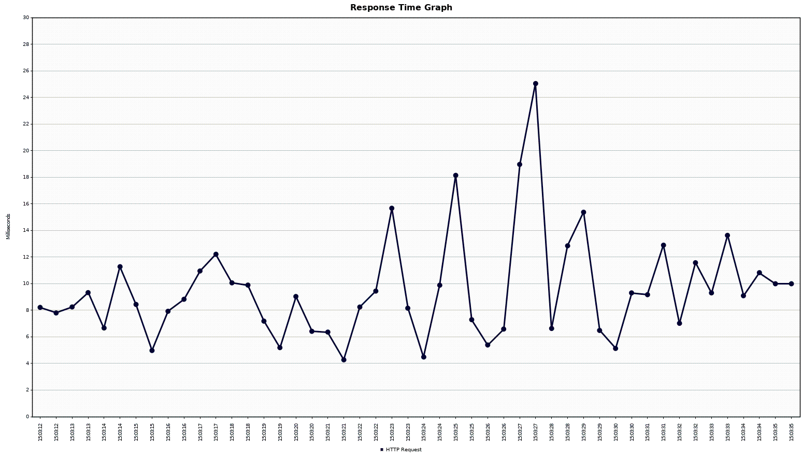
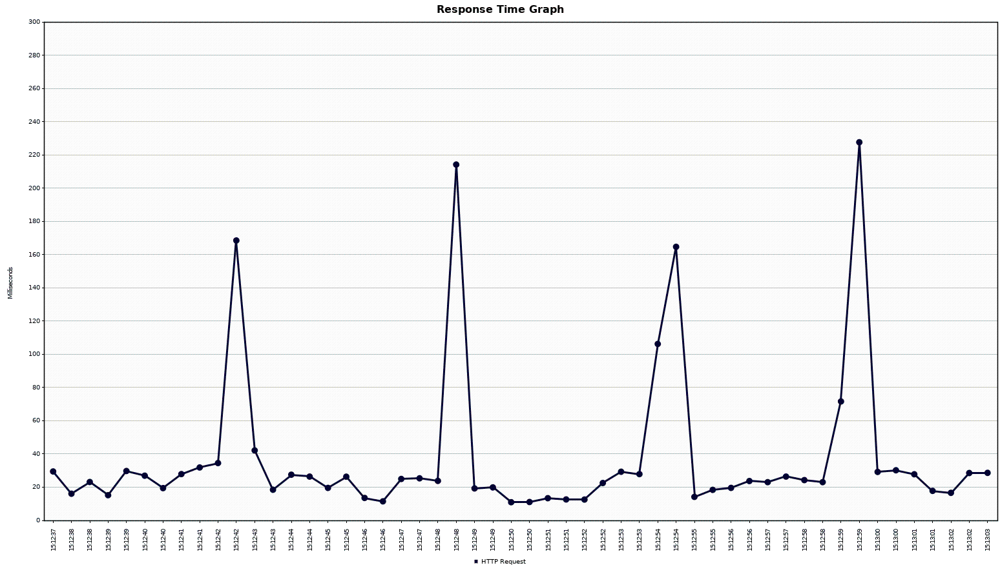

## Load Testing

We have done some tests about performance of ou web page. Here are the configs of JMeter for testing and a graph presentig the response time for each case.

### 1 million entries

With ressource tier pagination :

Using JMeter to simulate 20 users doing 100 requests (2000 requests total). And added a gaussian random timer with a constant delay of 200ms. 

We can see that in the average we have a pretty good performance with a load of the page in 1s. The server handles the requests in seconds.

With service tier pagination :

Simulated 2 users doing 10 requests each (20 requests total). And with a Gaussian random timer with a constant delay of 2000ms.

We can see that the server handles the requests in like minutes, and it takes a large amount of the RAM (actually all of it on a 16GB Ram laptop). But we can see drops of the response time (maybe Grabage collector doing his job or maybe SWAP, we don't really know). But we van see that is not efficient.

### 20'000 entries

With ressource tier pagination :

Simulating 20 users doing 100 requests each (2000 requests total). With a Gaussian random timer and a constant delay of 200ms.

The server handles the queries much more faster, in fact for the pagination 

With service tier pagination :

Simulating 2 users doing 10 requests each (20 requests total). With a Gaussian random timer and a constant delay of 2000ms.

We can see that the server can handle some requests but take much more time, by the way the RAM disapeared in this case too.

### 1000 entries

With ressource tier pagination :

With 1k entries we can see that the server is really fast. The RAM taken is not so big.

With Service tier pagination :

With 1k entries and loading Service tier we an see that is pretty fast but still not as much as the ressource tier solution.

## Conclusion
We can see that for a large amount of data, pagination is required. In fact, the server sometimes dies trying to respond to a large amount of requests with a pagination implemented on the service tier. So we see the importance of loading only the required data.

---
[Return to the main readme](https://github.com/capito27/Teaching-HEIGVD-AMT-2019-Project-One/blob/master/README.md)
