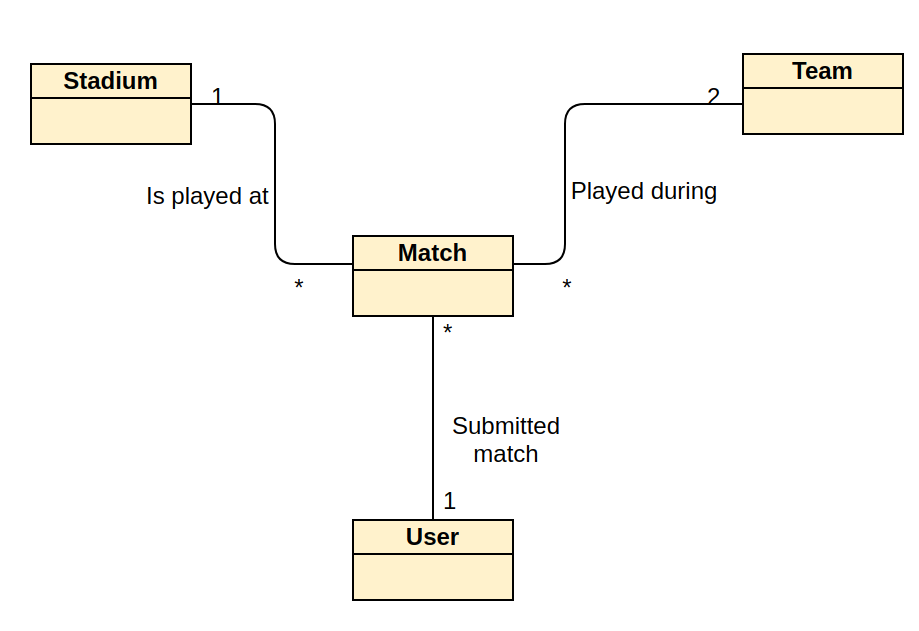
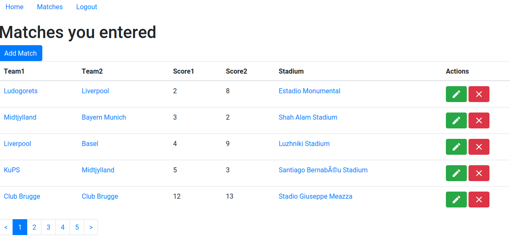
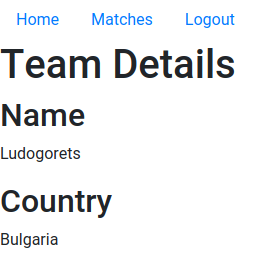
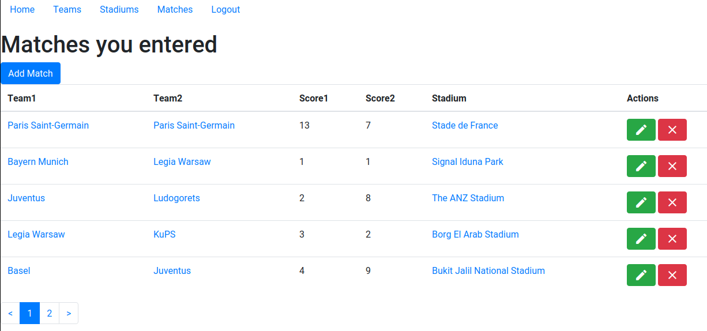

## Project-One

### Buisness domain : 
For this project, we decided to go with an online platform listing sports matches, allowing users to submit new matches and to edit their own matches, but consult every match in the platform.

A match is played inside a stadium, which is located in a country, has a name and the number of viewers it can fit.
A match is played by exactly 2 teams, which are from a country/town, and have a name.
Finally, a match is submitted by a user, and may only be modified by themselves.

Stadiums and teams may only be modified by administrator users.

### Buisness diagram :

### List of implemented functional aspects : 
 
#### CRUD
 
In this project, we have implemented a full CRUD access to our buisness entities through the website. Creating/Reading/Deleting those entities may requires specific privilèges (admin status, or ownership).
 
#### Navigation
It is possible to navigate between entities.
As an example, opening the match list, users can click on a specific team, or a specific stadium, to get its details
 
 
 
 
When clicking on the `Ludogorets` link, we get taken to the following page :
 
 

#### Acces control

The application allows users to register as standard users, having access to edit or delete their matches, or create new matches.

If a user attempts to accesses the team or stadium CRUD page without being an admin, they will be redirected to the index.

A user will not be shown links they can't acces if they don't have the rights to (or aren't logged in).

#### Data is scoped

A user may not view the details of other users' matches (mainly the stadium it took place in).

The example bellow shows an admin having the `teams` and `stadiums`
options in the matches page.

---
[Return to the main readme](https://github.com/capito27/Teaching-HEIGVD-AMT-2019-Project-One/blob/master/README.md)